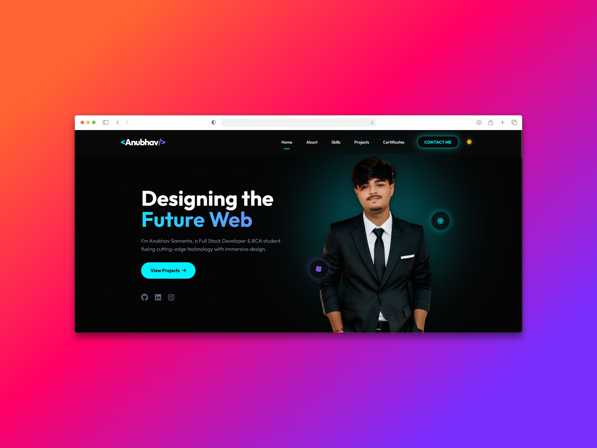

<h1 align="center">Hi 👋, I'm Anubhav Samanta</h1>
<h3 align="center">A Passionate Full Stack Developer & BCA Student from India 🇮🇳</h3>

<p align="center">
  <a href="https://anubhavsamanta.vercel.app/" target="_blank">
    
  </a>
  
  
</p>

---

## 🚀 Project Showcase

<p align="center">
  <a href="https://anubhavsamanta.vercel.app/">
    
  </a>
  <br>
  <i>Click the image above to view the live website!</i>
</p>

---

## 🌟 About This Project

This is my **Next-Generation Personal Portfolio**, meticulously crafted to showcase my skills, projects, and professional journey. It features a modern **Glassmorphism** design, buttery-smooth **GSAP animations**, and full responsiveness across all devices. The UI seamlessly transitions between a vibrant Light Mode and a sleek Dark Mode.

---

## 🛠️ Tech Stack & Tools

<p align="center">
  
  
  
  
  
</p>

---

## ✨ Key Features

* **🌗 Dark/Light Mode:** Seamless theme toggling with custom gradients and background environments.
* **🪞 Glassmorphism UI:** Premium frosted-glass effects on navigation menus, cards, and modals.
* **🎬 Advanced Animations:** Staggered text reveals, floating 3D VFX, dynamic counting stats, and interactive hover effects powered by GSAP & CSS.
* **📱 Fully Responsive:** 100% mobile-friendly with a custom blurred glass hamburger menu for smaller screens.
* **📧 Working Contact Form:** Integrated with **FormSubmit** to receive user messages directly to my inbox securely without a backend.
* **🖼️ Modal Popups:** Interactive custom modal viewer for certificates with instant download functionality and background scroll-lock.
* **⚡ High Performance:** Hardware-accelerated animations, lazy-loaded images, and optimized DOM rendering for zero-lag mobile scrolling.

---

## 📂 Directory Structure

```text
anubhav-portfolio/
├── assets/
│   ├── images/
│   │   ├── certificates/   # High-res IBM & Techno AI Certificates
│   │   ├── projects/       # Project thumbnails (ARIS, BioNexus, etc.)
│   │   ├── profile-cutout.png # Hero section transparent avatar
│   │   └── showcase.png    # 3D Mockup showcase image
├── index.html              # Main HTML file containing the entire UI structure
├── favicon.png             # Website Favicon
└── README.md               # You are reading this!