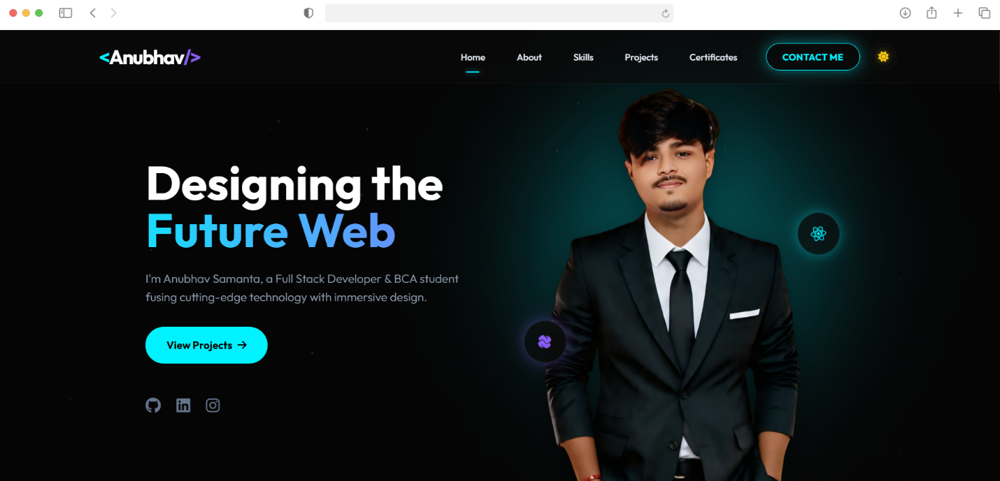

# 🚀 Anubhav Samanta — Portfolio Website

<div align="center">



<br><br>

<a href="https://anubhav-portfolio-delta-kohl.vercel.app/">
  
</a>

&nbsp;&nbsp;

<a href="https://github.com/Anubhav2321">
  
</a>

</div>

---

## 👨‍💻 About Me

Hi! I'm **Anubhav Samanta**, a passionate developer and **AI/ML enthusiast** focused on building modern, interactive and intelligent digital experiences.

I enjoy transforming ideas into real-world applications by combining **web development, Python, AI/ML and creative UI/UX design**.

I'm continuously learning, experimenting with new technologies and working on projects that solve practical problems.

> 💡 **Build. Learn. Experiment. Improve. Repeat.**

---

## ⚡ What I Do

<table>
<tr>
<td width="50%">

### 🌐 Web Development

Building responsive and modern web applications with clean UI, smooth interactions and user-focused experiences.

</td>

<td width="50%">

### 🤖 AI / ML

Exploring Artificial Intelligence and Machine Learning to build intelligent and useful applications.

</td>
</tr>

<tr>
<td width="50%">

### 🐍 Python Development

Working with Python for application development, automation, AI/ML and problem solving.

</td>

<td width="50%">

### 🎨 UI / UX

Creating futuristic, responsive and visually engaging interfaces with a focus on usability.

</td>
</tr>
</table>

---

# 🛠️ Tech Stack

<div align="center">

### 🌐 Frontend


<br><br>

### 🐍 Programming & Backend


<br><br>

### 🗄️ Database


<br><br>

### 🔧 Tools & Development


</div>

---

# 🚀 Featured Projects

<div align="center">

| Project | Description |
|:---:|:---|
| 🎓 **Advance LMS** | A modern Learning Management System designed for students and educational activities. |
| 🤖 **ARIS AI** | An AI-powered desktop assistant focused on intelligent interaction and automation. |
| 🧬 **BioNexus** | An AI-powered health architecture with intelligent health tracking and recommendations. |
| 📄 **Doc Simplifier** | A document-focused application designed to simplify complex information. |
| 🌦️ **Weather App** | A responsive weather application with clean and interactive data presentation. |
| 🐍 **Snake Game** | A modern implementation of the classic Snake Game with interactive gameplay. |

</div>

---

## 🧬 BioNexus

**BioNexus — Advanced AI Health Architecture**

An intelligent health-focused application designed to combine AI-powered assistance with health tracking and analysis.

### ✨ Highlights

- 🤖 AI-powered health assistance
- 📊 Health tracking
- 🧠 Intelligent recommendations
- 💡 Data-driven insights
- 🎨 Futuristic UI/UX
- ⚡ Interactive user experience

---

## 🎓 Advance LMS

A Learning Management System designed to provide students with a centralized digital learning environment.

### ✨ Highlights

- 👨‍🎓 Student-focused experience
- 📚 Learning management
- 📝 Assignments
- 🏫 Classroom-oriented workflow
- 📱 Responsive interface

---

## 🤖 ARIS AI

An AI-powered desktop assistant project focused on creating an interactive assistant experience.

### ✨ Highlights

- 🧠 AI interaction
- 🎙️ Voice-oriented functionality
- ⚙️ Automation
- 🐍 Python-based development
- 💻 Desktop assistant experience

---

# 🏆 Certifications

<div align="center">

| Certificate | Area |
|:---:|:---:|
| 🧠 IBM AI Introduction | Artificial Intelligence |
| 🤖 IBM Large Language Models | Generative AI / LLM |
| ✍️ IBM Prompting | Prompt Engineering |
| 🐍 Python Fundamentals | Python |
| 📊 Python Data Science | Data Science |
| 🎓 EduSkills | Technical Learning |

</div>

---

# 📂 Project Structure

```text
portfolio-website/
│
├── .vscode/
│   └── settings.json
│
├── assets/
│   └── images/
│       │
│       ├── certificates/
│       │   ├── EduSkills.jpeg
│       │   ├── ibm-ai-intro.jpg
│       │   ├── ibm-llm.jpg
│       │   ├── ibm-prompting.jpg
│       │   ├── techno-python-beg.jpg
│       │   └── techno-python-ds.jpg
│       │
│       ├── projects/
│       │   ├── advance-lms.jpg
│       │   ├── aris-ai.jpg
│       │   ├── bionexus.jpg
│       │   ├── doc-simplifier.jpg
│       │   ├── portfolio.jpg
│       │   ├── snake-game.jpg
│       │   └── weather-app.jpg
│       │
│       ├── profile-cutout.png
│       └── showcase.png
│
├── favicon.png
├── index.html
└── README.md
```
# 🚀 Getting Started

### 1️⃣ Clone the Repository

```bash
git clone https://github.com/Anubhav2321/portfolio-website.git
```

### 2️⃣ Navigate to the Project

```bash
cd portfolio-website
```

### 3️⃣ Run the Website

This is a static website, so you can directly open:

```text
index.html
```

in your browser.

For development, you can also use **VS Code Live Server**.

---

# 🌐 Portfolio

<div align="center">

<a href="https://anubhav-portfolio-delta-kohl.vercel.app/" target="_blank">
  
</a>

<br><br>

<a href="https://anubhav-portfolio-delta-kohl.vercel.app/" target="_blank">
  <strong>🌐 anubhav-portfolio-delta-kohl.vercel.app</strong>
</a>

</div>

---

# 📱 Responsive Design

The portfolio is optimized for:

```text
🖥️ Desktop
💻 Laptop
📱 Mobile
📲 Tablet
```

The interface adapts to different screen sizes while maintaining a clean and modern user experience.

---

# ✨ Key Features

* 🌑 Dark / Light Mode
* ⚡ Smooth Animations
* 🎨 Modern Futuristic UI
* 🌌 Animated Background
* 💎 Glass-style UI Elements
* 🧊 Interactive 3D Skill Cards
* 📊 Animated Skill Indicators
* 📱 Fully Responsive
* 🏆 Certification Showcase
* 🚀 Project Showcase
* 🖼️ Project Preview Images
* 📩 Contact Section
* ⚡ Performance-focused Design

---

# 🔮 Future Improvements

* 🤖 Add more AI/ML projects
* 📊 Add GitHub contribution statistics
* 📝 Add technical blog section
* 🔍 Improve SEO
* ♿ Improve accessibility
* 🌍 Add multilingual support
* 📈 Add project analytics
* 🎬 Add more advanced micro-interactions
* 🚀 Improve overall performance

---

# 📊 Development Philosophy

<div align="center">

### I believe great software should be:

**⚡ Fast** • **🎨 Beautiful** • **📱 Responsive** • **🧠 Intelligent**

**🔐 Secure** • **🧩 Maintainable** • **🚀 Scalable**

</div>

---

# 🤝 Connect With Me

<div align="center">

<a href="https://github.com/Anubhav2321" target="_blank">
  
</a>

   

<a href="https://anubhav-portfolio-delta-kohl.vercel.app/" target="_blank">
  
</a>

<br><br>

### 👨‍💻 Anubhav Samanta

**Full Stack Developer • AI/ML Enthusiast • Problem Solver**

<br>

*"Turning ideas into intelligent, interactive and meaningful digital experiences."*

</div>

---

<div align="center">

### ⭐ If you like my work, consider giving this repository a star!

<br>

**Made with ❤️ and lots of ☕ by Anubhav Samanta**

<br>

`Code` • `Create` • `Learn` • `Innovate`

</div>
